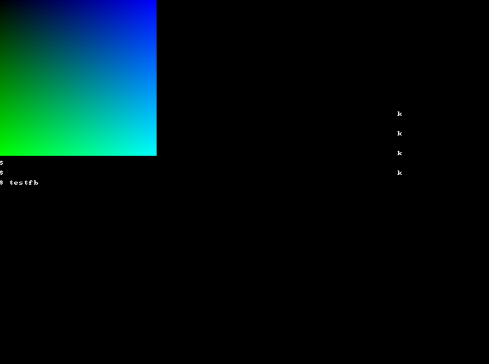

# aurora
A x86 kernel written in C mostly as a learning experience 

 

## Supports
- [x] Framebuffer terminal
- [x] Multitasking via a round-robin scheduler
- [x] Loading elf files via multiboot
- [x] Accessing FAT32 filesystems via 
- [ ] Paging (broken at the moment)
